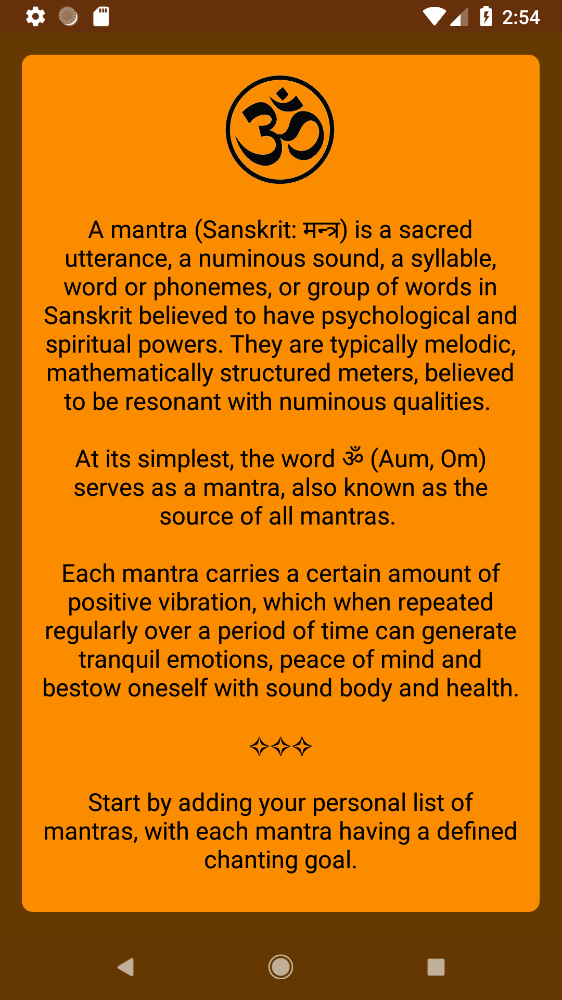

# Chants Journal
An Android app to create and maintain a record of all your mantras and the chants that you do daily.
This app has been made by keeping Material Design guidelines, in mind.

## Screenshots
&ensp;&ensp;

&ensp;&ensp;
